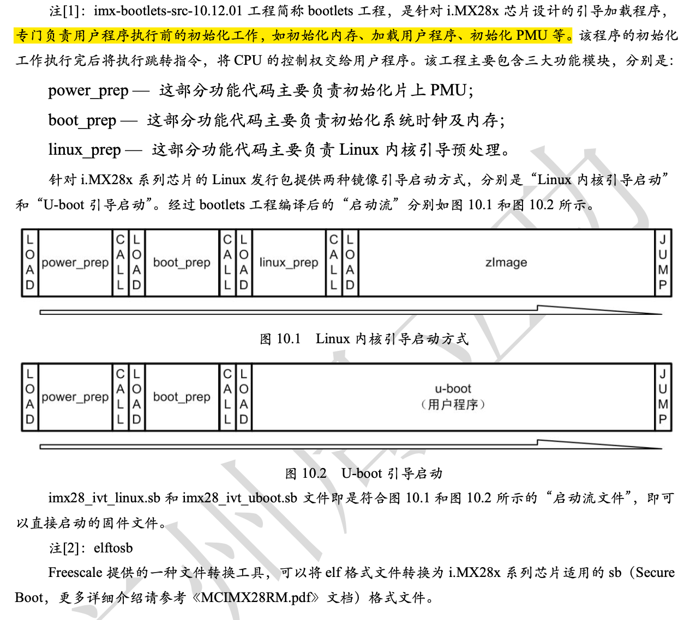

# i.MX283 Bootloader 编译指南

## 概述

本文档介绍如何编译适用于 i.MX28x 系列芯片的 U-Boot bootloader。

## 目录结构

解压 `bootloader.tar.bz2` 后得到以下目录结构：

```
bootloader/
├── elftosb/              # 文件转换工具（32bit/64bit）
├── u-boot-2009.08/       # U-Boot 源代码
└── imx-bootlets-src-10.12.01/  # bootlets 引导加载程序
```

## 准备工作

### 1. 解压源码包

将光盘资料中的 `bootloader.tar.bz2` 文件复制到 Linux 主机的工作目录，然后解压：

```bash
$ tar -jxvf bootloader.tar.bz2
```

### 2. 了解编译流程

- **u-boot-2009.08** 目录内包含 U-Boot 源代码
- 编译后得到 `u-boot` 文件
- 需通过 `imx-bootlets-src-10.12.01` 工程进一步编译成 `imx28_ivt_uboot.sb` 文件
- 最终的 `.sb` 文件用于烧写到 NAND Flash

---

## 技术说明

### 注[1]：imx-bootlets-src-10.12.01 工程

**bootlets 工程**是针对 i.MX28x 芯片设计的引导加载程序，专门负责用户程序执行前的初始化工作，如初始化内存、加载用户程序、初始化 PMU 等。

该工程包含三大功能模块：

- **power_prep** — 负责初始化片上 PMU
- **boot_prep** — 负责初始化系统时钟及内存
- **linux_prep** — 负责 Linux 内核引导预处理

#### 两种引导启动方式

i.MX28x 系列芯片的 Linux 发行包提供两种镜像引导启动方式：

1. **Linux 内核引导启动** → 生成 `imx28_ivt_linux.sb`
2. **U-boot 引导启动** → 生成 `imx28_ivt_uboot.sb`

> 💡 参考图 10.1 和图 10.2 了解详细的启动流程

### 注[2]：elftosb 工具

**elftosb** 是 Freescale 提供的文件转换工具，可以将 ELF 格式文件转换为 i.MX28x 系列芯片适用的 **SB (Secure Boot)** 格式文件。

> 📖 详细介绍请参考《MCIMX28RM.pdf》文档

---

## 编译步骤

### 方法一：手动编译（完整步骤）

#### 步骤 1：清除原有编译文件

进入 `u-boot-2009.08` 目录并清除编译文件：

```bash
$ cd bootloader/u-boot-2009.08
$ make ARCH=arm CROSS_COMPILE=arm-fsl-linux-gnueabi- distclean
```

#### 步骤 2：配置 U-Boot 平台

配置为 `mx28_evk_config` 平台：

```bash
$ make ARCH=arm CROSS_COMPILE=arm-fsl-linux-gnueabi- mx28_evk_config
```

输出示例：
```
Configuring for mx28_evk board...
```

#### 步骤 3：编译 U-Boot

执行编译命令：

```bash
$ make ARCH=arm CROSS_COMPILE=arm-fsl-linux-gnueabi-
```

编译完成后，在 `u-boot-2009.08` 目录的根目录下得到 `u-boot` 文件。

> ⚠️ **注意**：`u-boot` 文件不能直接烧写到 NAND Flash，需要进一步转换。

#### 步骤 4：复制 u-boot 文件

将 `u-boot` 复制到 `imx-bootlets-src-10.12.01` 目录：

```bash
$ cp u-boot ../imx-bootlets-src-10.12.01
```

#### 步骤 5：安装 elftosb 工具

根据 Linux 系统位宽选择对应的工具：

```bash
$ cd ../elftosb/
$ mv elftosb_64bit elftosb  # 若系统是 32bit，则选择 elftosb_32bit
$ sudo cp elftosb /usr/bin/
$ sudo chmod 777 /usr/bin/elftosb
```

> 💡 如使用官网提供的 Ubuntu，则不需要 chmod 操作

#### 步骤 6：生成最终固件

进入 `imx-bootlets-src-10.12.01` 目录并执行编译：

```bash
$ cd ../imx-bootlets-src-10.12.01
$ ./build
```

编译完成后，`imx28_ivt_uboot.sb` 文件即为可烧写到 NAND Flash 的固件文件。

> 📖 具体烧写方法请参考 **9.5 小节"烧写 U-Boot"** 的内容

---

### 方法二：使用编译脚本（推荐）

为了简化操作，在 `u-boot-2009.08` 目录下提供了专用的编译脚本 `build-uboot`。

#### 执行脚本

```bash
$ ./build-uboot
```

#### 菜单选项

脚本执行后会显示以下菜单：

```
U-Boot build menu, please select your choice:
1 make distclean
2 config for mx28
3 build U-Boot
q exit
```

按照提示输入菜单对应的数字并按回车键即可。

> ✅ "build U-Boot" 选项已包含将 `u-boot` 复制到 `imx-bootlets-src-10.12.01` 工程并编译的操作  
> ✅ 最终编译结果位于 `imx-bootlets-src-10.12.01` 工程目录下

#### ⚠️ 重要提示

为确保脚本正确执行，请注意：

1. 保持 `imx-bootlets-src-10.12.01` 目录与 `u-boot-2009.08` 目录在同一文件夹下
2. 不要随意修改 `imx-bootlets-src-10.12.01` 工程下的 `build` 脚本文件
3. elftosb 文件的拷贝操作在 Linux 主机环境中仅需执行一次

---

## 总结

编译流程概览：

```
bootloader.tar.bz2
    ↓ 解压
u-boot-2009.08 → 编译 → u-boot
    ↓ 复制
imx-bootlets-src-10.12.01 + elftosb → 编译 → imx28_ivt_uboot.sb
    ↓ 烧写
NAND Flash
```
